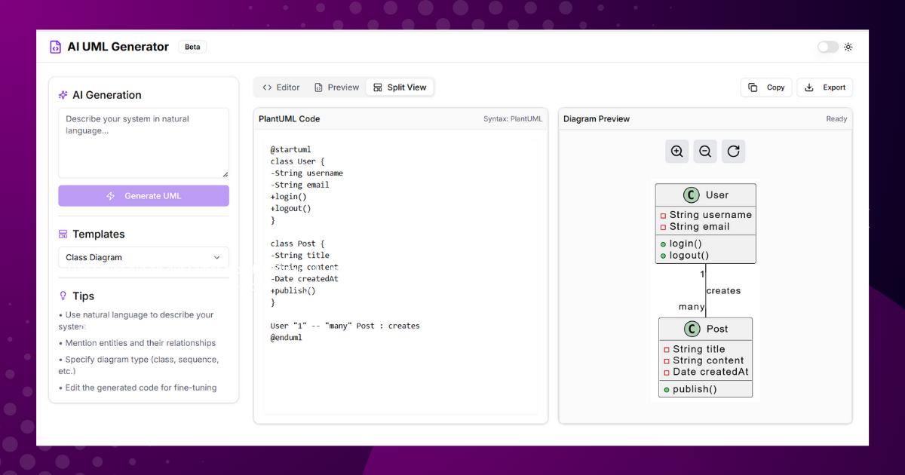

# UML Diagram Generator



A Next.js-based UML Diagram Generator that allows users to create UML diagrams
from textual descriptions using the PlantUML engine. It features an interactive
editor with live preview, zooming, panning, and reset functionalities.

## Features

- **ACE Editor**: Supports PlantUML syntax highlighting and editing.
- **Live UML Preview**: Generates UML diagrams dynamically.
- **Zoom & Pan**: Users can zoom and pan the diagram within a constrained area.
- **Reset Position**: Resets the diagram's position and zoom level.
- **Next.js & API**: Uses a backend API to generate UML code from text input.

## Installation

Clone the repository:

```bash
git clone https://github.com/Hamid-ul-Islam/uml-diagram-generator.git
cd uml-diagram-generator
```

Install dependencies:

```bash
npm install
```

## Usage

Start the development server:

```bash
npm run dev
```

Open [http://localhost:3000](http://localhost:3000) in your browser.

## API Endpoints

- `POST /api/generate-uml` - Accepts a story as input and returns the generated
  UML code.

## Technologies Used

- Next.js
- React
- PlantUML
- ACE Editor
- D3.js

## Contributing

Feel free to fork the project and submit pull requests.

## License

This project is licensed under the MIT License.
